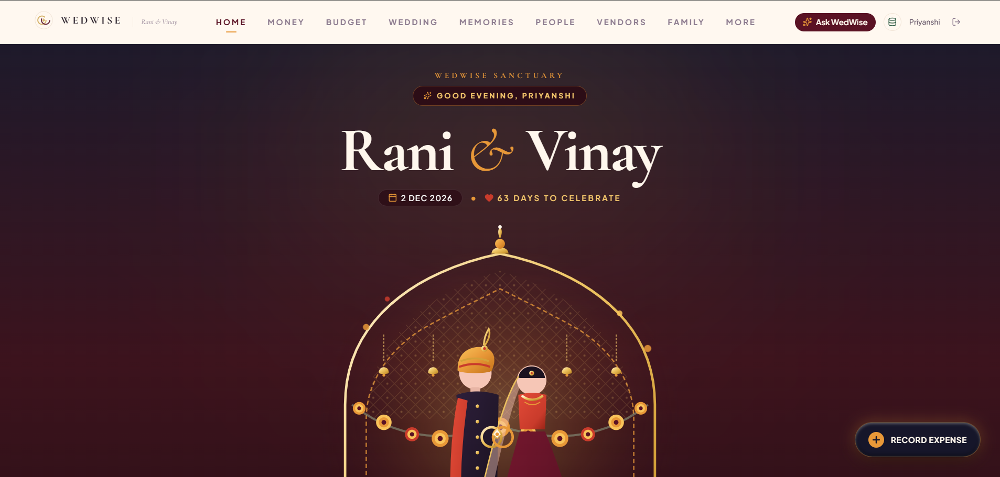
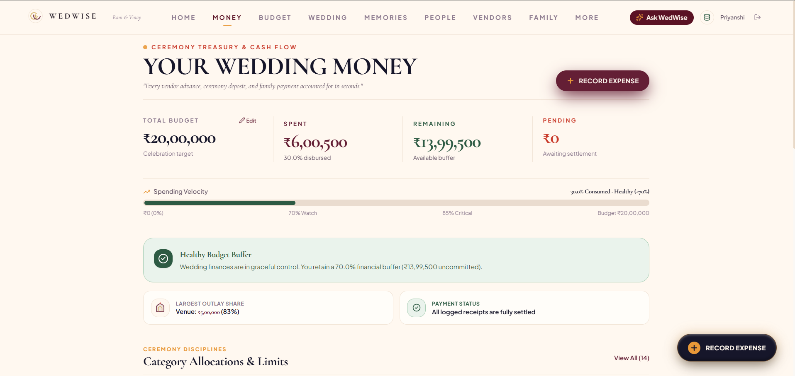
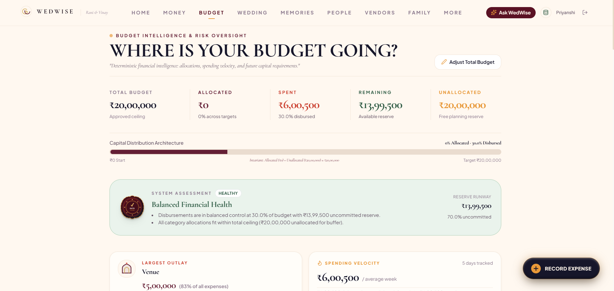
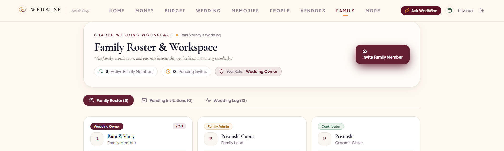
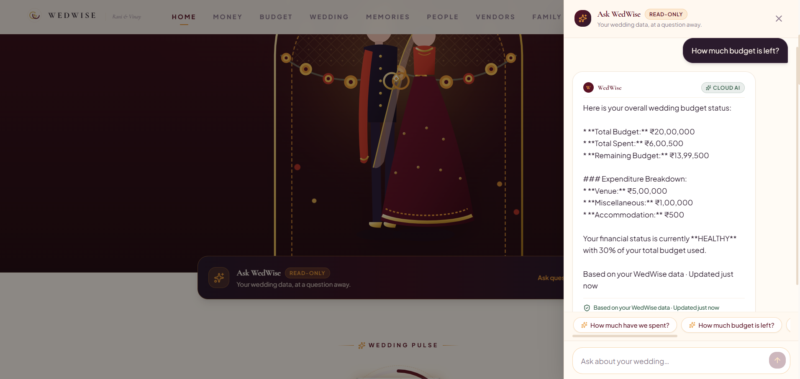
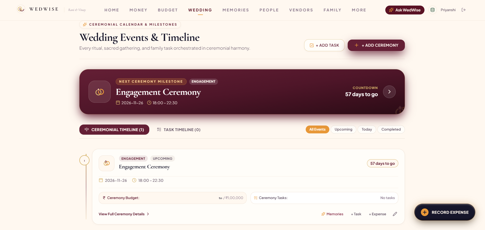

# WedWise 💍

### A Collaborative Wedding Operating System for Indian Families

**WedWise** is a mobile-first wedding management platform that turns the complexity of planning an Indian wedding into a shared digital workspace.

Instead of managing budgets in spreadsheets, guests in chats, vendors in notes, and memories somewhere else, WedWise brings **planning, money, people, vendors, tasks, events, memories, and AI assistance into one connected wedding workspace.**

> **Plan together. Spend smarter. Remember everything.**

🌐 **Live App:** https://wedwise-wedding.netlify.app
📦 **Repository:** https://github.com/priyanshi-gupta31/WedWise

---

## ✨ What Makes WedWise Different?

Most wedding planning tools focus on checklists or vendor discovery.

WedWise is designed as a **shared family workspace**.

A wedding can have multiple authorized family members with different permissions:

* 👑 **OWNER** — full wedding control
* 🛡️ **FAMILY_ADMIN** — manage the shared workspace
* ✏️ **CONTRIBUTOR** — add and update wedding information
* 👀 **VIEWER** — view permitted information

Everyone works on the **same wedding data**, rather than maintaining separate copies.

---

## 🚀 Core Features

### 💰 Budget & Expense Intelligence

* Wedding-level budget management
* Category-wise budgets
* Expense tracking
* Spending insights
* Pending payments
* Budget utilization
* Financial summaries
* Vendor payment integration
* Deterministic financial calculations

### 👨‍👩‍👧‍👦 Family Collaboration

* Invite family members using secure invitation links
* Role-based permissions
* Shared wedding workspace
* Invitation expiry and single-use protection
* Email invitations
* Activity tracking
* Wedding-level data isolation

### 📅 Events & Timeline

* Wedding ceremonies and events
* Event details
* Timeline planning
* Tasks and deadlines
* Wedding countdown
* Connected event/task workflow

### 👥 Guests & RSVP

* Guest management
* RSVP tracking
* Guest filtering
* Accommodation planning
* Transportation planning
* Headcount-aware planning

### 🏪 Vendors & Payments

* Vendor management
* Vendor categories
* Vendor details
* Contracts/documents
* Payment tracking
* Pending payment visibility
* Expense/payment synchronization

### 🤖 Ask WedWise AI

Ask questions about your actual wedding data.

Examples:

> "How much budget is left?"

> "How much have we spent?"

> "What is our largest expense?"

> "Which vendors are pending?"

The AI layer is connected to the wedding workspace, while **authoritative financial calculations remain deterministic** rather than being delegated to an LLM.

### 📸 Memories

* Wedding memory entries
* Photo uploads
* Memory details
* Lightbox viewing
* AI-assisted story polishing

### 💌 Cinematic Invitation Experience

WedWise includes a cinematic wedding invitation reveal using lightweight web-based visual effects, designed to make the first interaction feel like opening a digital wedding invitation rather than a conventional dashboard.

---

## 🏗️ Architecture

```text
                    ┌───────────────────────┐
                    │      WedWise PWA      │
                    │ React + TypeScript    │
                    │ Vite + Tailwind CSS   │
                    └───────────┬───────────┘
                                │
                                ▼
                    ┌───────────────────────┐
                    │      Supabase         │
                    │ Auth + PostgreSQL      │
                    │ Storage + RLS          │
                    └───────────┬───────────┘
                                │
                 ┌──────────────┼──────────────┐
                 ▼              ▼              ▼
          Wedding Data      Edge Functions   Storage
          Budget/Guests     AI + Email       Memories
          Vendors/Tasks     Server Logic
                 │              │
                 └──────────────┼──────────────┘
                                ▼
                         ┌──────────────┐
                         │ Gemini AI    │
                         │ Server-side  │
                         └──────────────┘
```

---

## 🛠️ Tech Stack

### Frontend

* React
* TypeScript
* Vite
* Tailwind CSS
* PWA
* Recharts
* Lucide React

### Backend & Data

* Supabase
* PostgreSQL
* Supabase Auth
* Supabase Storage
* Row Level Security (RLS)
* Supabase Edge Functions

### AI

* Google Gemini
* Server-side AI gateway
* Deterministic financial assistant fallback

### Deployment

* Netlify — frontend
* Supabase — backend/database/functions

---

## 🔐 Security

WedWise was designed with security and data isolation in mind.

* Supabase Row Level Security
* Wedding-level data isolation
* Role-based authorization
* Server-side AI secrets
* Server-side email credentials
* Secure invitation tokens
* Expiring invitation links
* Single-use invitation acceptance
* Case-insensitive invited-email verification
* No service-role credentials in the frontend
* Environment variables excluded from Git

Sensitive server credentials such as Gemini and Resend keys are stored in the Supabase Edge Function environment rather than client-side code.

---

## 📱 Progressive Web App

WedWise is built as a **PWA**, allowing users to install it from a supported browser and use it like an application on mobile devices.

The interface is designed mobile-first for common phone widths while remaining usable on larger screens.

---

## 🧩 Main Modules

```text
WedWise
│
├── Authentication
├── Wedding Setup
├── Dashboard
│
├── Budget Intelligence
│   ├── Budgets
│   ├── Expenses
│   ├── Payments
│   └── Spending Insights
│
├── Events & Timeline
├── Tasks
│
├── Guests
│   ├── RSVP
│   ├── Accommodation
│   └── Transport
│
├── Vendors
│   ├── Contracts
│   └── Payments
│
├── Family Collaboration
│   ├── Members
│   ├── Roles
│   └── Invitations
│
├── Ask WedWise AI
│
└── Memories
    ├── Photos
    └── Story Polisher
```

---

## 🔄 Invitation & Collaboration Flow

```text
Wedding Owner
      │
      ▼
Invite Family Member
      │
      ▼
Secure Invitation Token
      │
      ▼
Email / Share Link
      │
      ▼
Recipient Authentication
      │
      ▼
Email Verification
      │
      ▼
Accept Invitation
      │
      ▼
Join Existing Wedding
      │
      ▼
Role-Based Access
```

The recipient joins the **existing wedding workspace** rather than creating a duplicate wedding.

---

## 🧠 Design Philosophy

WedWise intentionally avoids looking like a generic enterprise dashboard.

The visual direction combines:

* Editorial wedding aesthetics
* Indian wedding-inspired geometry
* Arch and mandap-inspired forms
* Warm paper textures
* Marigold, sindoor, indigo and betel-green accents
* Wedding seal / pulse motifs
* Cinematic invitation interactions
* Mobile-first interaction patterns

The goal is to make the application feel like a **personal wedding companion**, not a spreadsheet with buttons.

---

## ⚙️ Getting Started

### 1. Clone the repository

```bash
git clone https://github.com/priyanshi-gupta31/WedWise.git
cd WedWise
```

### 2. Install dependencies

```bash
npm install
```

### 3. Configure environment variables

Create a `.env.local` file:

```env
VITE_SUPABASE_URL=your_supabase_project_url
VITE_SUPABASE_ANON_KEY=your_supabase_anon_key
```

See `.env.example` for the required variables.

### 4. Start development server

```bash
npm run dev
```

### 5. Build for production

```bash
npm run build
```

---

## 🌐 Live Demo

**WedWise:**
https://wedwise-wedding.netlify.app

---

## 📌 Project Status

**Production-ready V1**

The current version includes:

* Authentication
* Wedding workspace
* Budget & expenses
* Events & tasks
* Guests & RSVP
* Accommodation & transport
* Vendors & payments
* Family collaboration
* Secure invitations
* Ask WedWise AI
* Memories & photo uploads
* PWA support
* Production deployment

---

## 👩‍💻 Built With

**WedWise** was designed and developed as a full-stack project combining modern frontend engineering, relational data modeling, authorization, serverless functions, AI integration, and production deployment.

---

## 📄 License

This project is currently intended as a portfolio/academic project.
## 📸 Product Screenshots

### 🏠 Wedding Command Center



### 💰 Wedding Money & Cash Flow



### 📊 Budget Intelligence



### 👨‍👩‍👧‍👦 Shared Family Workspace



### 🤖 Ask WedWise AI



### 📅 Wedding Events & Timeline

